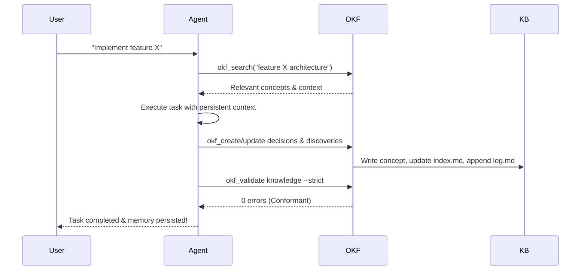

# rokf: R Interface to OKF Agent Memory

[](https://www.r-project.org/)
[](LICENSE)
[](https://github.com/okf-memory/okf-agent-memory/releases/tag/v0.1.2)

`rokf` provides a native R interface to **OKF Agent Memory** — a Git-native persistent memory layer for AI agents built on the [Open Knowledge Format (OKF) v0.2](https://github.com/GoogleCloudPlatform/knowledge-catalog/blob/main/okf/SPEC.md).

## What is OKF Agent Memory?

OKF Agent Memory solves the fundamental problem that **AI agent conversations are ephemeral**. When a context window resets, architectural decisions, domain discoveries, and operational facts are lost.

OKF Agent Memory provides:
- **Persistent knowledge** in your repository as plain Markdown + YAML (`knowledge/`)
- **Zero vendor lock-in** — everything is Git-tracked, human-readable, auditable via `git diff`
- **Sub-millisecond search** via in-memory BM25 (no vector DB, no embeddings, no API costs)
- **Built-in trust & provenance** — explicit separation of `generated` (agent) vs `verified` (human) knowledge
- **Progressive disclosure** — agents load only relevant concepts, slashing token bloat by ~80%

## Installation

```r
# From GitHub (recommended)
pak::pak("ashishtele/rokf")

# Or with remotes
remotes::install_github("ashishtele/rokf")

# The package includes pre-compiled binaries for:
# - Linux (amd64)
# - macOS (Intel + Apple Silicon)
# - Windows (amd64)
# Zero system dependencies required!
```

## Quick Start

```r
library(rokf)

# 1. Initialize a knowledge bundle in your project
okf_init("knowledge")

# 2. Bootstrap the full agent memory stack (optional but recommended)
# Creates: knowledge/, .agents/skills/okf-memory/, AGENTS.md, Makefile
okf_bootstrap(".", name = "My Project")

# 3. Create your first concept (search first!)
okf_create(
  "decisions/auth-strategy",
  type = "Decision",
  title = "Authentication Strategy",
  desc = "Standardized on OAuth2 PKCE for all client authentication"
)

# 4. Search existing knowledge (BM25 ranked)
okf_search("authentication", limit = 5)
#> # A tibble: 1 x 7
#>    rank score id                   type       title             description                           matches
#>   <int> <dbl> <chr>                <chr>      <chr>             <chr>                                 <chr>
#> 1     1  8.45 decisions/auth-strat Decision   Authentication Str~ Standardized on OAuth2 PKCE for a~ title, description

# 5. View full concept with graph links
okf_show("decisions/auth-strategy")

# 6. Validate your knowledge base
okf_validate("knowledge", strict = TRUE)
#> $is_conformant
#> [1] TRUE
```

## Core Functions

| Function | Purpose |
|----------|---------|
| `okf_init()` | Initialize bare OKF v0.2 bundle (`index.md`, `log.md`) |
| `okf_bootstrap()` | Scaffold full memory stack into any project |
| `okf_search()` | BM25 search across concepts (title, desc, tags, body) |
| `okf_show()` | Full concept: frontmatter, body, inbound/outbound links |
| `okf_create()` | Create concept + update index.md + append log.md |
| `okf_update()` | Modify concept + timestamps + log.md |
| `okf_relate()` | Link two concepts with context |
| `okf_validate()` | Conformance, graph health, provenance, drift, stale gates |
| `okf_version()` | Get okf binary version |
| `install_okf()` | Download/update bundled binary |

## Integration with R Agent Frameworks

### ellmer (recommended)

```r
library(ellmer)
library(rokf)

chat <- chat_openai(model = "gpt-4o")
chat$register_skill(okf_skill("knowledge"))

# Agent can now search, create, update, validate knowledge
chat$chat("Search for any authentication decisions in our knowledge base")
chat$chat("Create a decision concept for our new caching strategy")
```

### tidyllm

```r
library(tidyllm)
library(rokf)

okf <- okf_verbs("knowledge")

chat_openai() %>%
  okf$search("database connection pooling") %>%  # injects results as system msg
  chat("Summarize the pooling strategy") %>%
  okf$persist_as("decisions/db-pooling", type = "Decision") %>%
  okf$validate()  # validates bundle
```

## The OKF Workflow (Read-Work-Remember)

Every agent session follows this loop:



## Knowledge Concept Types

Use any type that fits your domain. Common ones:

- `Decision` — Architectural/technical choices with rationale
- `Architecture` — System/component structures
- `Fact` — Stable domain/project facts
- `Entity` — People, services, components, organizations
- `Runbook` — Operational procedures
- `Observation` — Non-obvious findings
- `Requirement` — Constraints, policies, boundaries

## Bundle Structure

```
knowledge/
├── index.md          # Root index (okf_version: "0.2")
├── log.md            # Dated change log (ISO 8601)
├── project/          # Overview, value props
├── architecture/     # System architecture concepts
├── decisions/        # Architectural decisions (ADRs)
├── conventions/      # Team conventions, standards
└── ...               # Your domain folders
```

All files are plain Markdown with YAML frontmatter — human-editable, diffable, reviewable.

## Why This Approach?

| Traditional Vector Memory | OKF Agent Memory (rokf) |
|---------------------------|-------------------------|
| Proprietary API, vendor lock-in | 100% Git-native, zero lock-in |
| Embedding API costs per query | $0 retrieval cost (local BM25) |
| Black-box semantic search | Transparent lexical BM25 + graph links |
| Opaque "memory" | Human-readable Markdown + YAML |
| Context stuffing | Progressive disclosure (80% token reduction) |
| No provenance | Explicit `generated`/`verified` trust tiers |

## License

MIT — see [LICENSE](LICENSE).

## Links

- [OKF Agent Memory (upstream)](https://github.com/okf-memory/okf-agent-memory)
- [OKF v0.2 Specification](https://github.com/GoogleCloudPlatform/knowledge-catalog/blob/main/okf/SPEC.md)
- [OKF Agent Memory Convention](https://github.com/okf-memory/okf-agent-memory/blob/main/docs/CONVENTION.md)
- [Agent Framework Gap blog series](https://ashishtele.github.io) — R-native agent architecture deep dives